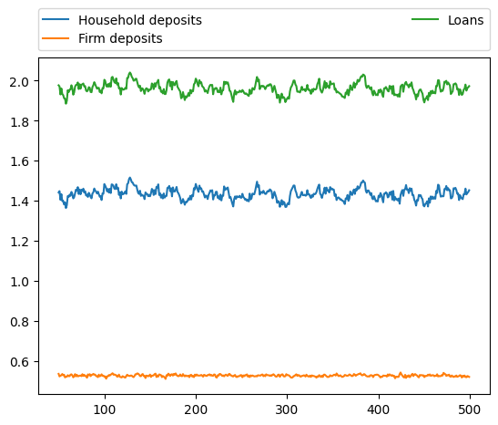

# Simulation Results from Steindl AB model #

## Simulation 1: zeta = 0.77 ##


```python
from absteindl import Steindl
from plotsims import plot
import logging

logger = logging.getLogger()
logger.setLevel(logging.INFO)

sim1 = Steindl(num_firms = 1000, num_periods = 500, seed = 2)

sim1.set_params(
    alpha1  = 0.7,  # consumption out of income
    alpha2  = 0.1,  # consumption out of wealth
    alpha3  = 0.0,  # inelastic saving out of salaries etc.
    gamma0  = 0.02, # trend growth
    gamma_r = 0.2,  # profit rate multiplier
    gamma_u = 0.04, # utilisation rate multplier
    iota    = 0.2,  # desired inventory to output ratio
    theta   = 0.5,  # desired liquidity ratio
    v       = 4,    # capital full output ratio
    llambda = 0.75, # profit retention ratio (lambda reserved)
    r_l_bar = 0.03, # interest rate
    tau     = 0.25, # mark-up
    pr      = 1,    # labour productivity
    zeta    = 0.77   # size to revenue feedback 
)

sim1.set_svars(
    Y    = 34,
    Y_hr = 27,
    K    = 100,
    I    = 10,
    IV   = 5,
    F_n  = 2.8,
    F_r  = 2.1,
    D_h  = 80,
    D_f  = 136,
    L    = 80 + 136,
    r    = 0.06,
    u    = 1.46
)

sim1.init_sectors()

```

    INFO:root:initialising model with 500 periods 1000 firms


```python
sim1.run()
```

    INFO:root:starting simulation for 500 periods with 1000 firms
    INFO:root:simulation complete


```python
plot(sim1)

```


    

    


    

    


    

    


    

    


    

    


    

    


    

    


    

    


## Simulation 2: zeta = 0.5 ##


```python

sim2 = Steindl(num_firms = 1000, num_periods = 500, seed = 1)

sim2.set_params(
    alpha1  = 0.7,  # consumption out of income
    alpha2  = 0.1,  # consumption out of wealth
    alpha3  = 0.0,  # inelastic saving out of salaries etc.
    gamma0  = 0.02, # trend growth
    gamma_r = 0.2,  # profit rate multiplier
    gamma_u = 0.04, # utilisation rate multplier
    iota    = 0.2,  # desired inventory to output ratio
    theta   = 0.5,  # desired liquidity ratio
    v       = 4,    # capital full output ratio
    llambda = 0.75, # profit retention ratio (lambda reserved)
    r_l_bar = 0.03, # interest rate
    tau     = 0.25, # mark-up
    pr      = 1,    # labour productivity
    zeta    = 0.5   # size to revenue feedback 
)

sim2.set_svars(
    Y    = 34,
    Y_hr = 27,
    K    = 100,
    I    = 10,
    IV   = 5,
    F_n  = 2.8,
    F_r  = 2.1,
    D_h  = 80,
    D_f  = 136,
    L    = 80 + 136,
    r    = 0.06,
    u    = 1.46
)

sim2.init_sectors()

```

    INFO:root:initialising model with 500 periods 1000 firms


```python
sim2.run()

```

    INFO:root:starting simulation for 500 periods with 1000 firms
    INFO:root:simulation complete


```python
plot(sim2)
```


    

    


    

    


    

    


    

    


    

    


    

    


    

    


    

    


```python
sim3 = Steindl(num_firms = 1000, num_periods = 500, seed = 2)

sim3.set_params(
    alpha1  = 0.7,  # consumption out of income
    alpha2  = 0.1,  # consumption out of wealth
    alpha3  = 0.0,  # inelastic saving out of salaries etc.
    gamma0  = 0.02, # trend growth
    gamma_r = 0.2,  # profit rate multiplier
    gamma_u = 0.04, # utilisation rate multplier
    iota    = 0.2,  # desired inventory to output ratio
    theta   = 0.5,  # desired liquidity ratio
    v       = 4,    # capital full output ratio
    llambda = 0.75, # profit retention ratio (lambda reserved)
    r_l_bar = 0.03, # interest rate
    tau     = 0.25, # mark-up
    pr      = 1,    # labour productivity
    zeta    = 0.7   # size to revenue feedback 
)

sim3.set_svars(
    Y    = 34,
    Y_hr = 27,
    K    = 100,
    I    = 10,
    IV   = 5,
    F_n  = 2.8,
    F_r  = 2.1,
    D_h  = 80,
    D_f  = 136,
    L    = 80 + 136,
    r    = 0.06,
    u    = 1.46
)

sim3.init_sectors()

```

    INFO:root:initialising model with 500 periods 1000 firms


```python
sim3.run()
```

    INFO:root:starting simulation for 500 periods with 1000 firms
    INFO:root:simulation complete


```python
plot(sim3)

```
